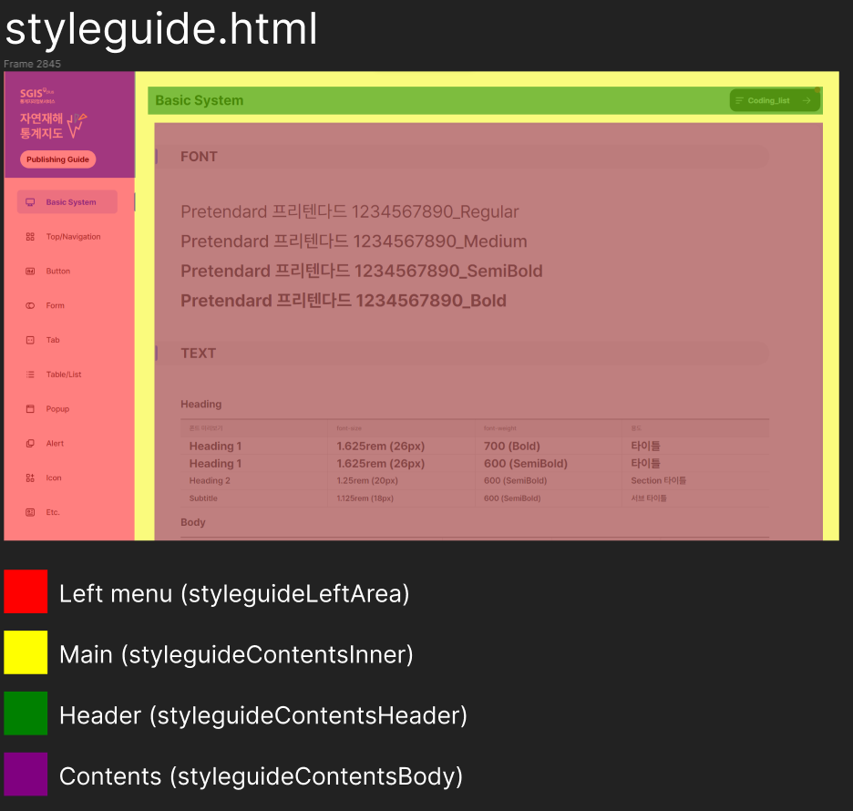
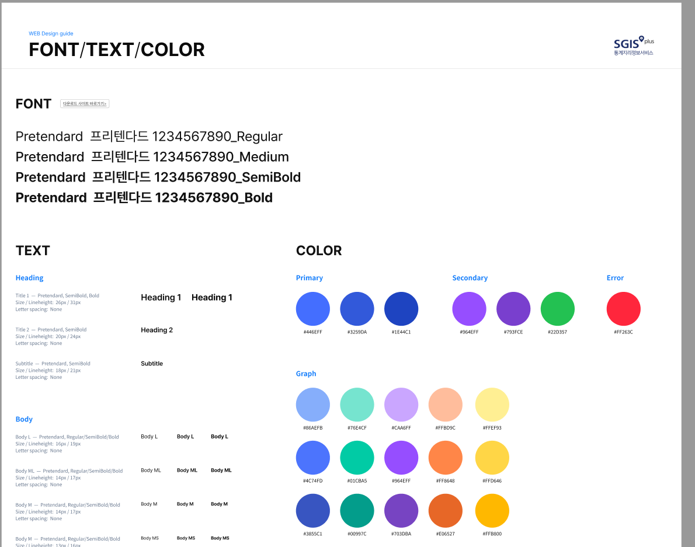

# 퍼블리싱 환경 (Gulp) 가이드

230525 반응형 프로젝트 기준입니다.

node js : 14.16.1v<br>
gulp : 2.3.0v<br>
jQuery : 1.12.4v<br><br>

## 로컬호스트 실행

gulp 세팅파일 zip으로 다운로드 (클론 X)


<br>

압축풀고 pre-build에서 npm install<br>


<br>


위와 같이 node_modules 폴더 생겼으면,


터미널 pre-build에서 gulp 실행!

<br><br>


### 자주 쓰는 라이브러리 목록

- [Swiper api](https://swiperjs.com/swiper-api)
- [Aos.js](https://github.com/michalsnik/aos)
- [jQuery ui Docs](https://api.jqueryui.com/)
- [jqGrid](http://trirand.com/blog/jqgrid/jqgrid.html)
- [RealGrid2](https://docs.realgrid.com/start/overview)
- [mScroll](https://manos.malihu.gr/jquery-custom-content-scroller/)
- [clipboard.js](https://clipboardjs.com/)
- [fullPage.js](https://github.com/alvarotrigo/fullPage.js/)
- [jQuery multisortable](https://github.com/shvetsgroup/jquery.multisortable)
- [jQuery splitter](https://github.com/jcubic/jquery.splitter)
- [jQuery easeScroll](https://creativestudio.kr/2113)<br>
**easeScroll 라이브러리 자체 코드 이슈가 있어서 아래 코드로 대체**<br>
[💡 코드 보기](./easeScroll.md)

<br>

## 작업폴더 구조 (pre-build)

```
📦pre-build
 ┣ 📂html
 ┃ ┣ 📂include
 ┃ ┃ ┣ 📂icons
 ┃ ┃ ┣ 📂styleguide
 ┃ ┃ ┣ 📜footer.html
 ┃ ┃ ┣ 📜head.html
 ┃ ┃ ┗ 📜header.html
 ┃ ┣ 📂styleguide
 ┃ ┣ 📜00_coding_list.html
 ┃ ┣ 📜index.html
 ┃ ┗ 📜styleguide.html
 ┣ 📂images
 ┣ 📂js
 ┃ ┣ 📜a11y.js
 ┃ ┣ 📜styleguide.js
 ┃ ┗ 📜ui.js
 ┣ 📂scss
 ┃ ┣ 📜button.scss
 ┃ ┣ 📜common.scss
 ┃ ┣ 📜component.scss
 ┃ ┣ 📜font.scss
 ┃ ┣ 📜hover.scss
 ┃ ┣ 📜mobile.scss
 ┃ ┣ 📜reset.scss
 ┃ ┣ 📜styleguide.scss
 ┃ ┣ 📜variable.scss
 ┃ ┣ 📜_function.scss
 ┃ ┗ 📜_mixins.scss
 ┣ 📜.babelrc
 ┣ 📜gulpfile.js
 ┣ 📜package-lock.json
 ┗ 📜package.json
```
<br>

 - html : HTML 파일을 모아둔 폴더입니다. 페이지가 추가되면 쉽게 볼 수 있게 반드시 `00_coding_list.html` 에 추가해야합니다.

    - include : 헤더나 푸터처럼 공통된 요소들을 담아둔 폴더입니다. <br> 폴더 안에 html을 만든 후 아래처럼 선언해주면 됩니다. 

    ```html
    @@include('include/header.html')
    ```

    ---

    ### styleguide 

    

    다른 html 파일들과 헷갈리지 않게 하기위해 styleguide 폴더를 따로 생성하였습니다. 대략적인 구조는 위와 같습니다!
   
    #### html 폴더 바로밑에 있는 styleguide 폴더
    컴포넌트들을 카테고리 별로 보여주기 위해 생성한 폴더입니다.
    해당 html은 `left menu` 와 `styleguideContents` 를 담고있습니다.

    <br/>

    #### include 폴더 안에있는 styleguide 폴더
    페이지 안에 들어가는 콘텐츠들을 담고있는 폴더입니다.
    해당 html은 `styleguideContentsInner` 안에 
    hedaer와 contentsBody가 들어가게 됩니다.

    <br/>

    #### styleguide.scss
    스타일가이드 페이지에서만 사용합니다. 다른 화면들과 겹치지 않기 위해 상위 div인 `styleguideRoot` 에서 시작합니다.

    <br/>

    #### variable.scss

    

    위처럼 디자인 가이드가 제공되었을경우 폰트 크기나 컬러값들을 변수로 등록합니다. (없을경우 생략합니다)

    <br/>

    #### styleguide.js
    스타일가이드 페이지에서만 사용합니다.

    ```js
    if($root.find('.styleguideRoot').length > 0) {
        $root.css('position', 'static');
    }
    ```

    최상위 div인 `#root` 가 position이 `fixed` 일경우, 스타일가이드 페이지에선 기본값으로 설정합니다.

    <br/>

    

    첫 페이지 (basic System 나오는 부분)을 제외한 나머지 페이지들은 파일경로가 다르기 때문에, left menu의 로고 이미지나 메뉴 이동 링크의 경로를 **현재 파일 경로에 맞게** 바꿔줘야합니다.

    ```js
    // 현재 경로에 /html/styleguide.html이 포함된경우 (첫 페이지)
    if (location.pathname.includes('/html/styleguide.html')) {
        $firstMenuItem.attr('href', styleguideUrl);
        $('.styleguideLeftAreaLogo').attr('src', '../images/common/logo/img-if-logo.png');

    // 현재 경로가 /html/styleguide/styleguide_top_navi.html 이런식으로 시작하는경우
    } else {
        styleguideUrl = '../styleguide.html';
        codingList = '../../html/00_coding_list.html';
        $firstMenuItem.attr('href', styleguideUrl);
        $('.styleguideLeftAreaLogo').attr('src', '../../images/common/logo/img-if-logo.png');
    }
    ```
    로고 이미지를 바꾸려면, `$('.styleguideLeftAreaLogo').attr('src', '../images/common/logo/img-if-logo.png');` 이부분을 바꾸면 됩니다.
<br>

<br>

---

- images : 프로젝트에 쓰이는 아이콘이나 이미지들을 모아둔 폴더입니다. 크게 bg (background) , ico (icon) , common (공통 이미지들) 로 나뉘어 있으며 프로젝트에 따라 구조는 달라질 수 있습니다.

<br>

- js : js 파일을 모아둔 폴더입니다. 

    - ui.js : UI 제어에 사용되는 코드만 작성합니다.
    - styleguide.js : 스타일가이드 페이지에서만 사용되는 코드만 작성합니다.
    - a11y.js : 접근성 제어에 사용되는 코드만 작성합니다.

<br>

- scss : scss 파일을 모아둔 폴더입니다.
(파일 명 앞에 언더바가 붙은 파일은 따로 build되지 않습니다.)

    - _function.scss : scss 설정 파일입니다.

    <br>

    ```scss
    $html-font-size: 16px;

    @function stripUnit($value) {
        @return $value / ($value * 0 + 1);
    }

    @function rem($pxValue) {
        @return #{stripUnit($pxValue) / stripUnit($html-font-size)}rem;
    }
    ```
    html 기본 폰트 사이즈를 16px로 설정하고, px 단위를 rem으로 변환 시켜주는 함수입니다. 반응형 프로젝트가 아니라면 px로 사용해도 무방합니다.

    사용은 다음과 같이 할 수 있습니다.

    ```scss
        .text{font-size: rem(16px);}

        /* => 적용 : 1rem */
    ```

    <br><br>
    
     - _mixins.scss : scss mixin을 모아둔 파일입니다.

        아래는 font mixin을 사용한 예시이며, mixin은 작업자 편의에 따라 추가될 수도 있습니다.

    ```scss
        div{@include font(rem(60px),'pre Bold',#000);}
    ```

    <br><br>

    - button.scss : 버튼 스타일만 모아둔 파일입니다.

    - common.scss : header,gnb,footer 같은 공통 된 요소들의 스타일만 모아둔 파일입니다.
    
    - component.scss : wrapper,container,box,card 같은 레이아웃을 구성하는 요소들의 스타일을 모아둔 파일입니다.

    - font.scss : font 들을 모아둔 파일입니다.

    - hover.scss : hover 됬을 때 스타일들을 모아둔 파일입니다.

    ```css
    @media (hover:hover){

    }
    ```

    위 미디어쿼리 hover 구문은 PC에서만 호버 스타일을 적용하고 모바일은 적용하고 싶지 않을 때 사용합니다. 반응형 프로젝트가 아니라면 사용 할 필요가 없겠습니다.

    <br>

    - mobile.scss : 반응형 처리 스타일들을 모아둔 파일입니다.
    - reset.scss : css 스타일 초기화 코드 및 공통으로 사용되는 클래스들을 모아둔 파일입니다.
    - styleguide.scss : 스타일가이드 페이지에서만 사용됩니다.
    - variable.scss : 자주 사용되는 컬러값이나 폰트들을 변수로 저장하여 사용합니다.
<br><br>

## 배포폴더 구조 (build)

```
📦build
 ┣ 📂css
 ┃ ┣ 📂font
 ┃ ┃ ┗ 📂pretendard
 ┃ ┣ 📜button.css
 ┃ ┣ 📜common.css
 ┃ ┣ 📜component.css
 ┃ ┣ 📜font.css
 ┃ ┣ 📜hover.css
 ┃ ┣ 📜mobile.css
 ┃ ┣ 📜reset.css
 ┃ ┣ 📜styleguide.css
 ┃ ┗ 📜variable.css
 ┣ 📂html
 ┃ ┣ 📂include
 ┃ ┃ ┣ 📂icons
 ┃ ┃ ┣ 📂styleguide
 ┃ ┃ ┃ ┣ 📜alert.html
 ┃ ┃ ┃ ┣ 📜basicSystem.html
 ┃ ┃ ┃ ┣ 📜button.html
 ┃ ┃ ┃ ┣ 📜etc.html
 ┃ ┃ ┃ ┣ 📜form.html
 ┃ ┃ ┃ ┣ 📜hljs.html
 ┃ ┃ ┃ ┣ 📜icon.html
 ┃ ┃ ┃ ┣ 📜left.html
 ┃ ┃ ┃ ┣ 📜modal.html
 ┃ ┃ ┃ ┣ 📜pagination.html
 ┃ ┃ ┃ ┣ 📜tab.html
 ┃ ┃ ┃ ┣ 📜table_list.html
 ┃ ┃ ┃ ┗ 📜topNavigation.html
 ┃ ┃ ┣ 📜footer.html
 ┃ ┃ ┣ 📜head.html
 ┃ ┃ ┗ 📜header.html
 ┃ ┣ 📂styleguide
 ┃ ┃ ┣ 📜styleguide_alert.html
 ┃ ┃ ┣ 📜styleguide_button.html
 ┃ ┃ ┣ 📜styleguide_etc.html
 ┃ ┃ ┣ 📜styleguide_form.html
 ┃ ┃ ┣ 📜styleguide_icon.html
 ┃ ┃ ┣ 📜styleguide_modal.html
 ┃ ┃ ┣ 📜styleguide_pagination.html
 ┃ ┃ ┣ 📜styleguide_tab.html
 ┃ ┃ ┣ 📜styleguide_table_list.html
 ┃ ┃ ┗ 📜styleguide_top_navi.html
 ┃ ┣ 📜00_coding_list.html
 ┃ ┣ 📜index.html
 ┃ ┗ 📜styleguide.html
 ┣ 📂images
 ┣ 📂js
 ┃ ┣ 📜a11y.js
 ┃ ┣ 📜styleguide.js
 ┃ ┗ 📜ui.js
 ┗ 📂lib
```

 build 에서는 작업 폴더 (pre-build) 에서 작업한 파일들이 build 폴더로 올라가게 됩니다. **파일 명이 변경되거나, 파일이 추가/삭제** 될 경우, build 폴더에 히스토리가 그대로 남게됩니다.

> 이럴경우, 빌드 폴더 청소를 위해, build에서 파일이 변경 된 폴더를 지우고 pre-build에서 다시 gulp를 실행해야 합니다. (주로 html 폴더나 이미지 폴더)

<br>
   
- font : 프로젝트에 사용되는 폰트 파일들을 모아둔 폴더입니다. 프로젝트에 따라 추가될 수 있습니다.

- lib : 프로젝트에 사용되는 라이브러리 폴더 / 파일들을 모아둔 폴더입니다. 프로젝트에 따라 추가될 수 있습니다.